<a id="readme-top"></a>

<details>
  <summary>Table of Contents</summary>
  <ol>
    <li>
      <a href="#about-the-project">About The Project</a>
      <ul>
        <li><a href="#built-with">Built With</a></li>
      </ul>
    </li>
    <li>
      <a href="#getting-started">Getting Started</a>
      <ul>
        <li><a href="#prerequisites-http-only">Prerequisites (http only)</a></li>
        <li><a href="#installation">Installation</a></li>
        <li><a href="#default-access-credentials-for-testing">Default Access Credentials (For testing)</a></li>
        <li><a href="#features">Features</a></li>
      </ul>
    </li>
    <li><a href="#contact">Contact</a></li>
  </ol>
</details>


<!-- ABOUT THE PROJECT -->
## About The Project

We hope to create a platform where people can find volunteering and donation opportunities and get small rewards for their help. Users would be rewarded with points for their volunteering efforts and donations, where they can use these rewards to redeem some forms of incentives. Though these incentives would not be comparable to the efforts the users gave, it would still be a reward to the users. Through these, we hope to encourage more people to help those in need through donations and volunteering efforts.


### Built With

* [![React.js][React.js-logo]][React.js-url]
* [![Axios][Axios-logo]][Axios-url]
* [![Tailwind CSS][Tailwind-logo]][tailwind-url]
* [![Huawei Cloud][Huawei-logo]][huawei-url]


<!-- GETTING STARTED -->
# Getting Started

### Prerequisites (http only)

* npm
  ```sh
  npm install npm@latest -g
  ```
* Backend launched. Refer to the README.md in the <a href="https://github.com/g5-heapheaphooray/backEnd">Backend</a> repository.

### Installation
#### http
1. Clone the repo
   ```sh
   git clone https://github.com/g5-heapheaphooray/frontend.git
   ```
2. Install NPM packages
   ```sh
   npm clean install
   ```
3. Change into project directory
    ```sh
   cd heap
   ```
4. Launch frontend
    ```sh
   npm start
   ```

#### https
   
1. Clone the repo
   ```sh
   git clone https://github.com/g5-heapheaphooray/frontend.git
   ```
2. Go to Settings > Privacy and security > <a href="chrome://settings/security">Security</a> > Manage certificates in Chrome.
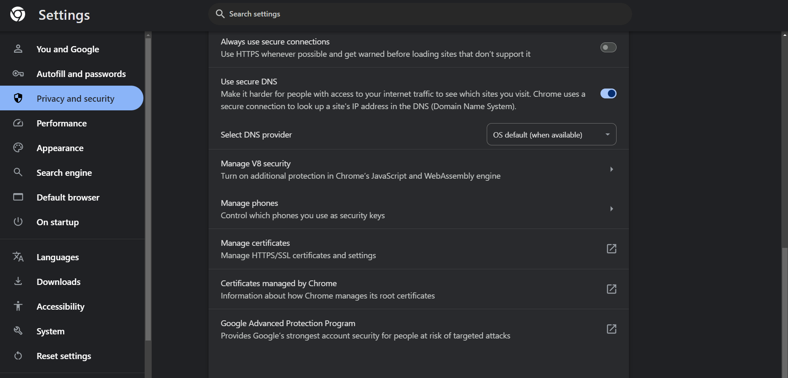
3. Go to Trusted Root Certification Authorities and click Import…

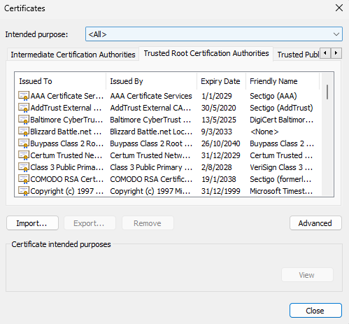

4. Click Next and then click Browse… to select the certificate you'd downloaded.

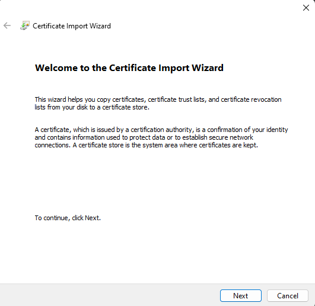

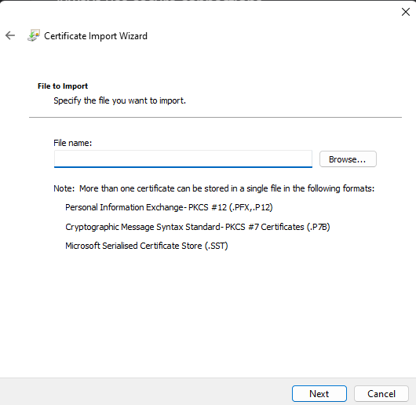

5. Go to the repository folder and find [`frontend-cert.crt`](./frontend-cert.crt). Use that as the certificate.

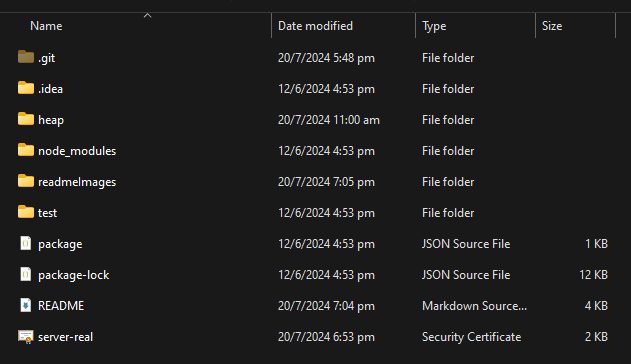

6. Click Next.

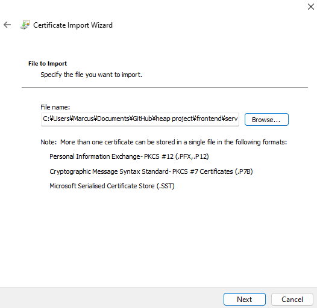

7. Check the option Place all certificates in the following stores and then click Next.

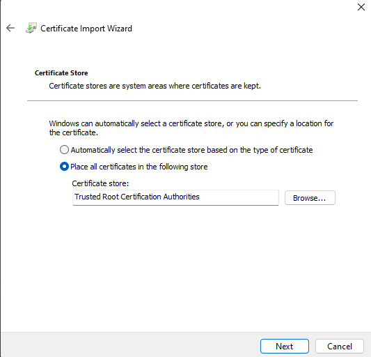

8. Click finish.

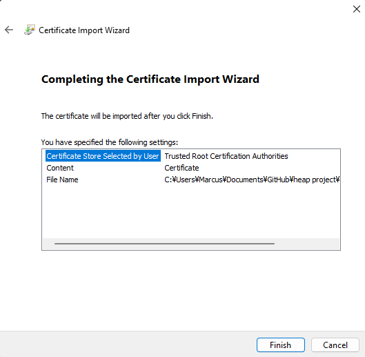

9. A Security Warning message pops up. Click Yes and then click OK to finish the import.

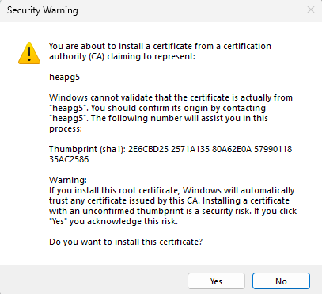

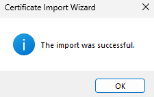

10. Repeat steps 2-9 but for [`backend-cert.crt`](./backend-cert.crt) as well.

11. Open the webpage <a href="https://101.44.162.159:3000">here</a>

<p align="right">(<a href="#readme-top">back to top</a>)</p>


<!-- Access Credentials -->

### Default Access Credentials (For testing)

#### Organisation
  &nbsp;&nbsp;&nbsp;&nbsp;**Email:** org@mail.com \
  &nbsp;&nbsp;&nbsp;&nbsp;**Password:** 123

#### Volunteer 
  &nbsp;&nbsp;&nbsp;&nbsp;**Email:** vol@mail.com \
  &nbsp;&nbsp;&nbsp;&nbsp;**Password:** 123

#### Admin
  &nbsp;&nbsp;&nbsp;&nbsp;**Email:** admin@mail.com \
  &nbsp;&nbsp;&nbsp;&nbsp;**Password:** 123
<p align="right">(<a href="#readme-top">back to top</a>)</p>


<!--Features -->
### Features

#### Organisation
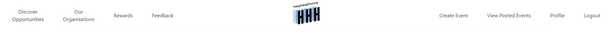
<div>
<ul>
  <li>Discover Opportunities</li>
  <ul>
    <li>View Opportunities</li>
  </ul>

  <li>Our Organisations</li>
  <ul>
    <li>View Organisations</li>
  </ul>

  <li>Rewards</li>
  <ul>
    <li>View Rewards</li>
  </ul>

  <li>Feedback</li>
  <ul>
    <li>Create Complaint</li>
    <ul>
        <li>Make a complaint about another user</li>    
    </ul>
  </ul>

  <li>Create Event</li>
    <ul>
        <li>Points of the event are calculated based on the number of hours.</li>
    </ul>
  
  <li>View Posted Events</li>
  <ul>
    <li>View Event</li>
      <ul>
        <li>Submit Volunteer Attendance</li>
        <ul>
            <li>Attendance is only allowed to be submitted once.</li>
            <li>Once attendance is submitted, the participants' points will get updated.
</li>
        </ul>
      </ul>
    <li>Edit Event</li>
    <li>Delete Event</li>
  </ul>

  <li>Profile</li>
  <ul>
    <li>View Profile</li>
    <li>Edit Profile</li>
<li>Toggle Website Theme</li>
    <li>Change Password</li>
  </ul>
</ul>
</div>

#### Volunteer
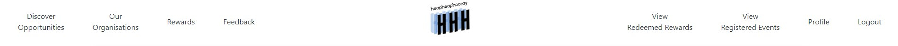

<div>
<ul>
  <li>Discover Opportunities</li>
  <ul>
    <li>View Opportunities</li>
<li>Searchbar to search for opportunities by name or organisation</li>
<li>Sort listed opportunities by name or date</li>
<li>Filter listed opportunities by cause, type, location or skill</li>
    <li>Register for Opportunities</li>
  </ul>

  <li>Our Organisations</li>
  <ul>
    <li>View Organisations</li>
<li>Searchbar to search for organisations</li>
  </ul>

  <li>Rewards</li>
  <ul>
    <li>View Rewards</li>
    <li>Redeem Rewards</li>
  </ul>

  <li>Feedback</li>
  <ul>
    <li>Create Complaint</li>
  </ul>

  <li>View Redeemed Rewards</li>
  <ul>
    <li>Use Rewards (barcode can only be seen once)</li>
  </ul>

  <li>View Registered Events</li>
  <ul>
    <li>Unregister Events</li>
  </ul>

  <li>Profile</li>
  <ul>
    <li>View Profile</li>
    <li>Edit Profile</li>
<li>Toggle Website Theme</li>
    <li>Change Password</li>
  </ul>
</ul>
</div>

#### Admin
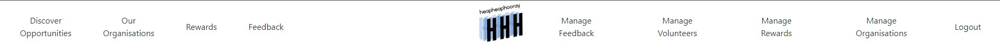
<div>
<ul>
  <li>Manage Feedback (Complaints)</li>
  <ul>
    <li>Resolve/Reject Feedback</li>
    <ul>
        <li>Resolve: Feedback made was valid. Complainee's complaint count will increase. Once a user's complaint count exceeds 3, the user's account will be locked.</li>
        <li>Reject: Feedback made was invalid. Complainee's complaint count would not be affected.</li>
    </ul>
    <li>Delete Feedback</li>
  </ul>

  <li>Manage Rewards</li>
  <ul>
    <li>Create Reward</li>
    <li>Upload Reward Barcodes</li>
    <ul>
        <li>Upload a csv file with the following format (refer to <a href="https://github.com/g5-heapheaphooray/frontend/blob/start/test.csv">test.csv</a>):<br>
        Reward Serial Number,Expiry Date <br>
        Reward Serial Number,Expiry Date <br>
        ...
        
</li>
    </ul>
    <li>Edit Reward</li>
    <li>Delete Reward</li>
  </ul>

  <li>Manage Users (Volunteers/Organisations)</li>
  <ul>
    <li>Blacklist/Whitelist User</li>
    <li>Delete Volunteer (No delete organisation)</li>
    <li>Verify Organisation</li>
    <ul>
        <li>When an organisation first register an account, their account would be unverified and the admin needs to verify their account before they are allowed to login.</li>
<li>After verification, the organisation will receive an email to inform them that their account has been verified and they can proceed to login.</li>
    </ul>
  </ul>

</ul>
</div>

#### Others


<div>
<ul>
  <li>Homepage</li>
  <ul>
    <li>Link to opportunities</li>
<li>Link to opportunities with some specific causes (carousel)</li>
<li>Link to organisations</li>
  </ul>

  <li>Forget Password</li>
  <ul>
    <li>Sends an email to the specified email address (if the user exists) containing a forget password link</li>
    <li>Link in email contains a token to identify the user and allow them to change their password</li>
  </ul>

<li>Login</li>
<ul>
    <li>Volunteers, organisations and admin login here</li>
<li>Link to forgot password</li>
<li>Links to sign up if they do not have an account</li>
</ul>

<li>Sign Up</li>
<ul>
<li>Register volunteers</li>
<li>Register organisations</li>
<li>Create admin account (only for testing not meant for real production environment)</li>
</ul>

  

</ul>
</div>

#### Miscellaneous

<div>
<ul>

<li>Media</li>
  <ul>
    <li>Media (profile picture, event images, reward image etc.) are stored in Huawei's OBS bucket.</li>
    <li>Images displayed are a link to the object in the OBS bucket.</li>
  </ul>

</ul>
</div>

<!-- CONTACT -->
## Contact

Frontend Project Link: https://github.com/g5-heapheaphooray/frontend <br>
Backend Project Link: https://github.com/g5-heapheaphooray/backEnd <br>
Hosted website: https://101.44.162.159:3000/ (please import both frontend-cert.crt and backend-cert.crt to your browser before accessing this page)

<p align="right">(<a href="#readme-top">back to top</a>)</p>


<!-- MARKDOWN LINKS & IMAGES -->
[React.js-logo]: https://img.shields.io/badge/React-20232A?style=for-the-badge&logo=react&logoColor=61DAFB
[React.js-url]: https://reactjs.org/
[Axios-logo]: https://img.shields.io/static/v1?style=for-the-badge&message=Axios&color=5A29E4&logo=Axios&logoColor=FFFFFF&label=
[Axios-url]: https://axios-http.com/
[Tailwind-logo]: https://img.shields.io/badge/tailwindcss-%2338B2AC.svg?style=for-the-badge&logo=tailwind-css&logoColor=white
[Tailwind-url]: https://tailwindcss.com/
[Huawei-logo]: https://img.shields.io/badge/Huawei-%23FF0000.svg?style=for-the-badge&logo=huawei&logoColor=white
[Huawei-url]: https://www.huaweicloud.com/intl/en-us/
